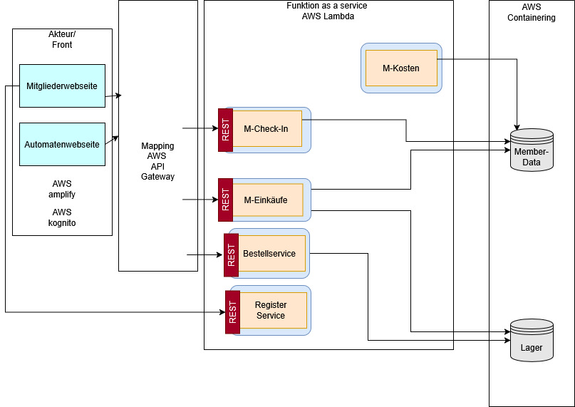

# Gym 2.0

Warum noch ein Gym mit Personal, wenn man 24/7 mit einfachen technischen Mitteln ein Studio betreten kann?
Durch einfaches Webdesign und lauffähigen Containern ist diese Applikation ein Allrounder für die Fitness-Szene!

GYM 2.0 revolutioniert das klassische Fitnessstudio-Konzept durch vollständige Automatisierung. Mitglieder verwalten Training, Zahlungen und Einkäufe bequem online und die Automaten für Snacks/Getränke verwalten automatisch den Lagerbestand über das System.
# Allgemeines
* [Teamspezifisches](https://github.com/GYM2-0Org/GYM2.0/blob/main/Wiki/Teamspezifisches.md)
* [Organisatorisches](https://github.com/GYM2-0Org/GYM2.0/blob/main/Wiki/Organisatorisches.md)
* [Meeting Protokolle](https://github.com/Davidchen/GYM2.0/blob/main/Wiki/Meeting_Protokolle.md)

# Regeln
* [Teamregeln](https://github.com/GYM2-0Org/GYM2.0/blob/main/Wiki/Teamregeln.md)
* [Code Konventionen](https://github.com/GYM2-0Org/GYM2.0/blob/main/Wiki/Code_Konventionen.md)
* [Issue Template](https://github.com/GYM2-0Org/GYM2.0/blob/main/Wiki/Issue-Template.md)
* [Pull Request Template](https://github.com/GYM2-0Org/GYM2.0/blob/main/github/pull_request_template.md)
* [Definition of Ready](https://github.com/GYM2-0Org/GYM2.0/blob/main/Wiki/DefOfReady.md)
* [Definition of Done](https://github.com/GYM2-0Org/GYM2.0/blob/main/WikiDefinition_of_Done.md)
* [Branches Richtlinien](https://github.com/GYM2-0Org/GYM2.0/blob/main/Wiki/Branch-Richtlinien.md)
* [How to Test](https://github.com/GYM2-0Org/GYM2.0/blob/main/Wiki/Testregeln.md)

# Projekt
* [Projektdetails]
* [Spezifikationen](https://github.com/GYM2-0Org/GYM2.0/blob/main/Wiki/Spezifikationen.md)

## Funktionen
* Mitglieder können jederzeit das Studio anhand ihrer Logingaten betreten. Es erfolgt eine Eingabe und nach einer Sicherheitsprüfung kann man das Gym betreten.
* Bevor es einen Login gibt, könne sich Mitglieder im Studio registrieren.
* Mitglieder können Einkäufe tätigen für Snacks/Getränke. Diese werden per Account gekauft und am Ende des Monats mit dem monatliche Betrag dazu abgebucht.
* Am Ende des Monats gibt es eine Übersicht an Snacks/Getränke, die noch übrig sind. Diese wird als LOG-Datei ausgegeben und kann entsprechend dem Lieferanten gegeben werden. 

## Skizze



## Programmspezifisches

### AWS
Für das Projekt werden hauptsächlich Funktionen der Amazon Web Services verwendet:

* alle Tools auflisten

### Download

* wenn überhaupt nötig

### Ausführung
* Step-by-Step wie man das aufsetzt bzw nur Anwendungsschicht
```
code blocks for commands
```     

## Version History 
* V0.1 Fundemente gesetzt und Funktionalität xxx umgesetzt
* V0.2 
