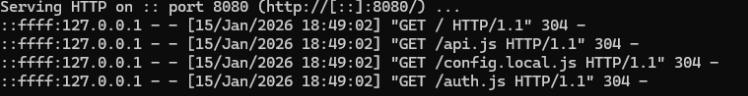
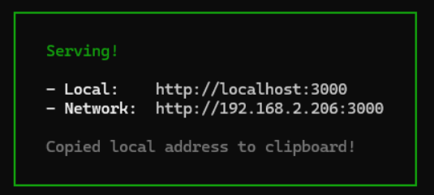
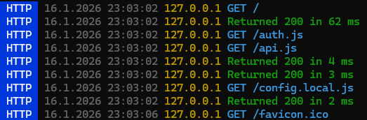

# Vorgehen lokaler Tests:
## Backend
Lambda Funktionen werden über dem jeweiligen test.json per Pipeline durchgelaufen
und bei Erfolg deployed.
Ohne CI/CD-Pipeline muss die test.json in der mjs der entsprechenden Lambdafunktion
liegen und man führt die Funktion aus. Bei erfolgreichem Durchlauf ist die Funktion so
weit funktionstüchtig.
## Frontend
Um lokal und visuell Feedback zu erhalten, wird das Zusammenspiel der js Funktionen
im Frontend getestet.

```
Man muss sich im Testverzeichnis befinden.
Zum Beispiel C:\Users\Tester\GitHub\GYM2.0\local-test
```

Wenn man das Projekt entsprechend als Node-Projekt konfiguriert
(package.json, package-lock.json, amplify_outputs.json, backend.ts) und mit dem
Befehl
```
python -m http.server 8080
```
oder
```
npx serve
```
einen Port freilegt, kann sowohl ein lokaler Test ausgeführt als auch lokal entwickelt werden.

## Hinweis:
So würden die entsprechenden Ausgaben auf der Konsole aussehen:
### python -m http.server 8080

### npx serve 

